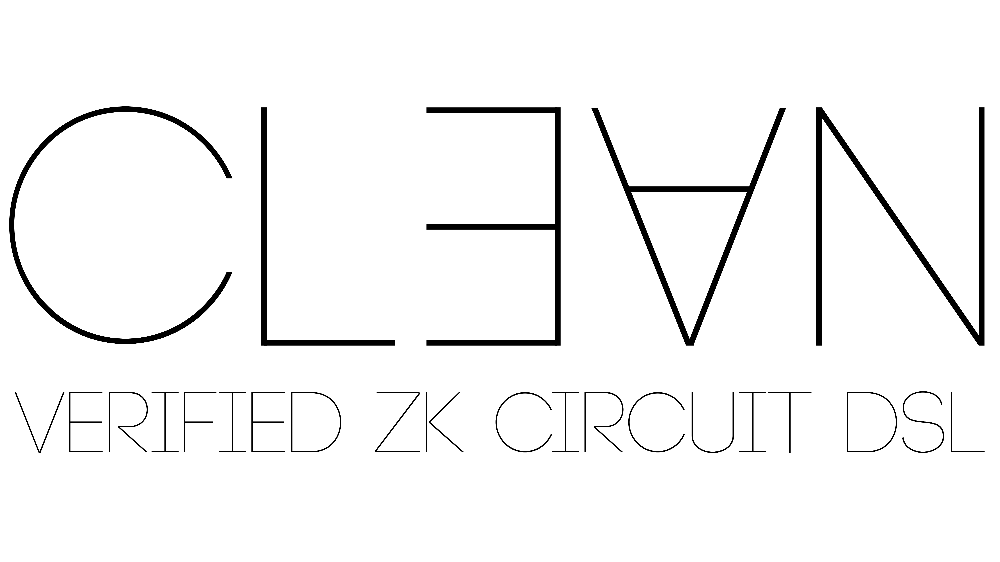

<p align="center">  </p>

<div align="center">

[![Chat on Telegram][ico-telegram]][link-telegram]
[![Ask DeepWiki][ico-deep-wiki]][link-deep-wiki]

</div>

`clean` is an embedded Lean DSL for writing zk circuits, targeting popular arithmetizations like AIR, PLONK and R1CS.

**Check out our blog post for an introduction: https://blog.zksecurity.xyz/posts/clean**

`clean` is developed by [zkSecurity](https://zksecurity.xyz/), currently as part of a Verified-zkEVM grant.

We intend to build out `clean` into a universal zk framework that produces **formally verified, bug-free circuits** for the entire ecosystem. See the [roadmap](#roadmap).

## Community

Public Telegram group to discuss `clean`: [t.me/clean_zk](https://t.me/clean_zk)

Please join if you want to use `clean`, or contribute, or if you have any questions!

We always welcome contributors! Check out our [good first issues](https://github.com/Verified-zkEVM/clean/issues?q=is%3Aissue%20state%3Aopen%20label%3A%22good%20first%20issue%22).

## Using the repo

Follow [official instructions](https://lean-lang.org/lean4/doc/setup.html) to install `elan` (the package manager) and Lean4.

Clone this repo, and test that everything works by building:

```bash
lake build
```

After that, we recommend open the repo in VSCode to get immediate inline feedback from the compiler while writing theorems.

Make sure to install the `lean4` extension for VSCode!

## Documentation

We are actively working on creating proper documentation for `clean`. In the meantime, we recommend checking out our [AI-generated DeepWiki](https://deepwiki.com/Verified-zkEVM/clean).

⚠️ **Disclaimer:** The wiki may contain inaccuracies or outdated details. Please take all information with a grain of salt until the official documentation is released.

## Code Style

We follow standard Lean/Mathlib conventions with some local variations. See [doc/conventions.md](doc/conventions.md) for details.

## Proof Finding Guide

Some heuristics for finding proofs are in [doc/proving-guide.md](doc/proving-guide.md).

## Roadmap

The following is a rough, longer-term roadmap for clean. Note that some of the bullets below could be multi-month projects!

Reach out [on TG](https://t.me/clean_zk) if you are looking for long-term contribution opportunities and you are interested in any of these!

- More general lookups + VM-like table ensembles
  - currently worked on by [zkSecurity](https://zksecurity.xyz/) https://github.com/Verified-zkEVM/clean/issues/252
  - subproject: support in plonky3 backend
- Polish plonky3 backend, generate constraint evaluation Rust code
  - currently worked on by [zkSecurity](https://zksecurity.xyz/) https://github.com/Verified-zkEVM/clean/pull/192
- clean documentation
  - will be worked on by [zkSecurity](https://zksecurity.xyz/)
- Witness generation: compile (subset of) Lean to IR, to generate fast WG code in backends
- Create clean circuits from LLZK
  - this gives us frontends like Circom
  - subproject: demonstrate actual e2e extraction from Circom
- Verifier challenges https://github.com/Verified-zkEVM/clean/issues/162
  - prove lookup protocols end to end
  - should be optional, should be able to abstract
- Explore if we can compose with ArkLib to get e2e verification
- More backends
  - stwo?
  - some R1CS
- Support PLONK circuits with custom gates
- Good AGENTS.md / CLAUDE.md
- AIR table foundation, more low-level, no monad
  - different entry points for different kinds of tables
- Support Binius
- Proof automation:
  - `circuit_proof_start` should handle vectors and general ProvableTypes
  - `circuit_proof_start` could detect subcircuits to unfold (in the right places)
  - better automation for `localLength_eq`, `subcircuitsConsistent` etc
- Advanced: Mixed proof systems like Longfellow-ZK
- MORE GADGETS
- MORE INTEGRATIONS
- 
## Attribution

The Lean name and logo are trademarks of Lean FRO.


[ico-telegram]: https://img.shields.io/badge/@clean__zk-2CA5E0.svg?style=flat-square&logo=telegram&label=Telegram
[link-telegram]: https://t.me/clean_zk

[ico-deep-wiki]: https://deepwiki.com/badge.svg
[link-deep-wiki]: https://deepwiki.com/Verified-zkEVM/clean
